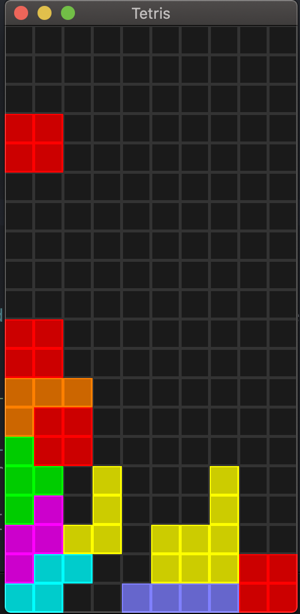

# Tetris

Projet réalisé par Victor Deyanovitch & Taj Singh & Elisa Gougerot

Langage de programmation : Rust

# Instruction d'installation


1) Installer [Rust](https://www.rust-lang.org) sur votre machine
2) Effectuez les commandes suivantes :

```
git clone https://github.com/ElisaGougerot/Tetris.git
cd Tetris
cargo run
```

# Instruction de jeu

Placer des pièces (7 formes cubiques différentes) qui descendent du haut vers la bas pour en former des lignes horizontales pleines. Dès qu'elle est pleine, la ligne est détruite et tous les cubes au-dessus de la ligne descendent d'une rangée.

* flèche du haut -> changer la position de la pièce
* flèche du bas -> accélerer la descente de la pièce
* flèche de droite -> déplacer la pièce sur la droite
* flèche de gauche -> déplacer la pièce sur la gauche

# Bibliothèques utilisées

* [rand](https://docs.rs/rand/0.7.3/rand/)
* [opengl_graphics](https://docs.rs/piston2d-opengl_graphics/0.71.0/opengl_graphics/)
* [piston_window](https://docs.piston.rs/piston_window/piston_window/)
* [std::time::Instant](https://doc.rust-lang.org/std/time/struct.Instant.html)
